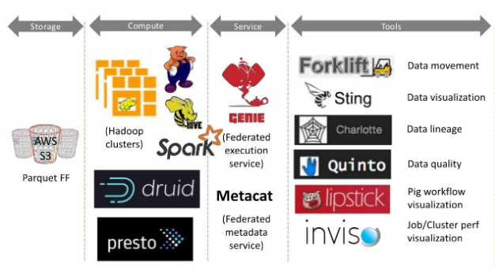
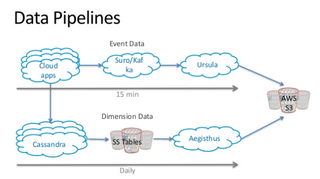
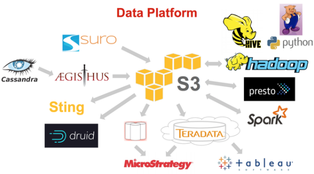
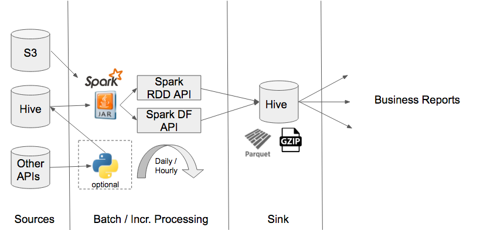

Data Platform
=============

At Netflix - we have a mature Big Data Processing Platform and the picture below describes major components that help us run batch processing jobs and produce business insights.
Major functions of the data platform are shown below.

Data Producers, Ingestion & Processing
======================================

Data is produced by almost every entity operating within Netflix. These include software clients, web pages, web servers, application servers, services & even humans (usually in form of spreadsheets).
All data producers have a way of transporting this data into our data warehouse which is hosted on Amazon S3.

Most popular technique used is the "Data Pipeline" which is a high throughput, low latency data-bus to transport data.
Data from application databases like cassandra are also pulled into S3 for processing. See picture below:

Once the data is available in S3 - data processing & data querying jobs are run on the compute clusters. These include Hive, Pig, Presto & Spark Jobs.
Ad-hoc querying lets us identify business rules that get subsumed into ETL jobs (typically in Pig or Spark). These ETL jobs crunch the data and produce outputs that are saved back in Hive (S3 for storage).

Reporting platforms like MicroStrategy, Tableau and other custom solutions are hosted on top if this data to deliver business insights.

A Typical Batch Oriented Data Pipeline (Spark)
==============================================
A typical Spark based data pipeline may consist of a pre-processing stage if necessary - like pulling down data into Hive if not already there, followed by a Scala-based Spark Job. 
The DataFrame API is almost always preferred since they process structured data sitting in Hive but there may be instances where the RDD APIs are used. These are scheduled Daily/hourly.

The output format is usually chosen as Parquet - but may changed to gzipped text files if using parquet is detrimental for the use-case.

References
==========

http://pt.slideshare.net/evamtse/the-evolution-of-the-big-data-platform-netflix-oscon-2015/14
http://pt.slideshare.net/evamtse/the-evolution-of-the-big-data-platform-netflix-oscon-2015/13
https://practicalanalytics.co/2015/06/11/databianalytics-evolution-netflix/