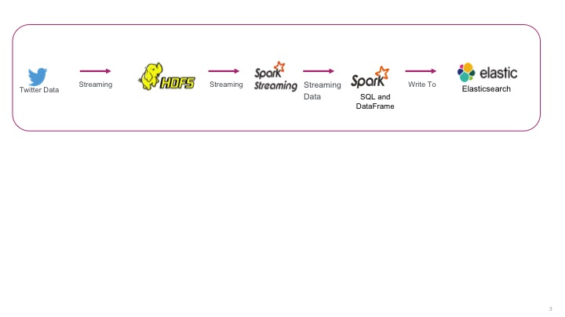
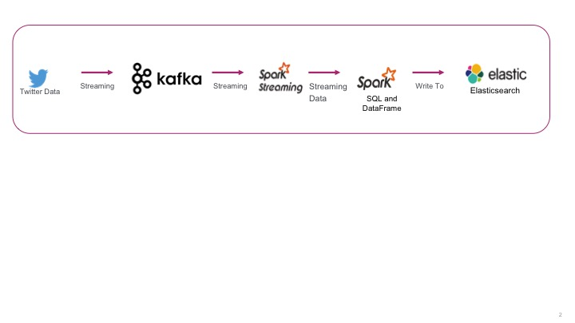
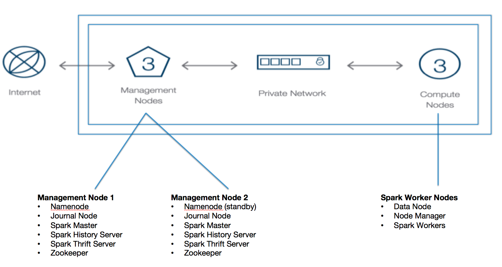

Apache Spark Reference Architecture - Streaming ETL
===================================================

Ingesting and performing data transformations via continously streaming of data is one of the common use cases in Apache Spark.

When talking about Streaming ETL, data could be coming from IoT devices, social media interactions, historical data etc. and can be classified into two main types :

-	Controlled Streaming : In this scenario, the data set volume is known ahead of time, and the data stream data is produce in a steady and controlled way (e.g. fixed volume of historical data). When dealing with controlled streaming data source, the addition of a message broker

-	Variable Streaming : In this scenario, the data set is being dynamically produced, for a long period, and the streaming volume of data vary with time (e.g. social data volume increases during a special event).

It's very important to understand the characteristics of your data stream, as it will dictate if your application should use a message broker such as Apache Kafka to help you control a steady flow of data even when the volume of data being pumped to the stream increases.

Common Streaming ETL use cases
==============================

Processing Logs

Processing Operational Metrics

Processing Social Data

Deployment Architecture
=======================

Deployment topology
-------------------

Hardware
--------

Softlayer machines with the following configuration :
24 cores, 128 GB RAM, 4 TB disk (4x1TB disks)

Enterprise configuration considerations
---------------------------------------

### HDFS Durability

Data availability and dirability in HDFS is acomplished by keeping replication at three; which would enable data recovery in case of disk failures.

### High Availability

HDFS availability can be accomplished by deploying the NameNode with high availability with at least three JournalNodes. The nodes should be placed into different racks to ensure they don’t all go down due to hardware failure or host maintenance.

Apache Spark availability can be acomplished by deploying multiple Spark Master nodes in conjunction with a Zookepper korum that would be used to master election.

### ZooKeeper

It is recommended to deploy at least three ZooKeeper instances for availability and durability reasons. It is also recommended using temporary disk storage for ZooKeeper data.

References
==========

https://github.com/koeninger/kafka-exactly-once/blob/master/blogpost.md
